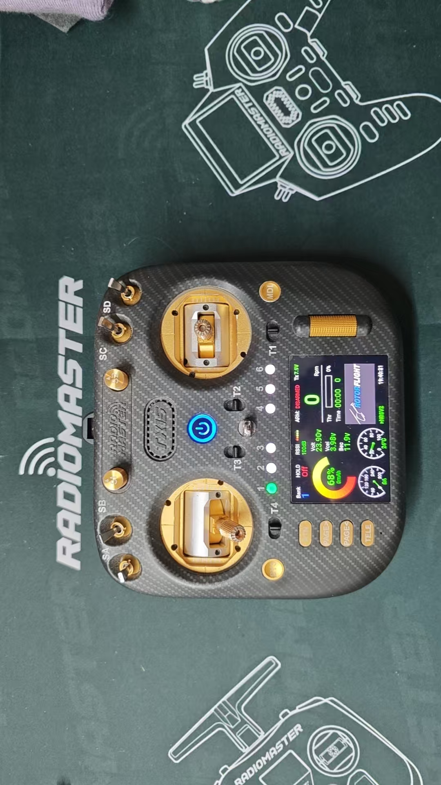
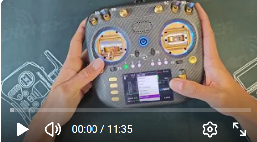

<div align="center">
  
</div>

# Rotorflight  Telemetry Widget for RadioMaster TX15

A comprehensive telemetry display widget designed specifically for the Rotorflight  helicopter when used with the RadioMaster TX15 transmitter.

<div align="center">
  <a href="https://youtu.be/BEuRPKlpn-U">
    
  </a>
</div>

## Overview

This Lua script provides real-time telemetry monitoring for your Rotorflight , displaying critical flight parameters in an easy-to-read format optimized for the TX15's screen. Simply copy to your SD card and activate in App Mode.

## Features

- **Helicopter-Specific Layout**: Tailored display for RadioMaster Nexus-X/XR parameters
- **Real-Time Telemetry**: Live updates of voltage, RPM, temperature, and signal
- **App Mode Optimization**: Full-screen display without transmitter UI clutter
- **Low Battery Alerts**: Visual and audio warnings (configurable thresholds)
- **RSS Signal Monitoring**: Signal strength bar with loss counter
- **Flight Timer Integration**: Automatic timer start/stop based on throttle

## Requirements

- RadioMaster TX15 transmitter (or compatible T15 series)
- OpenTX 2.3.x or EdgeTX 2.8+ firmware installed
- Rotorflight  with compatible telemetry receiver (elrs)
- Telemetry link established (RF module and receiver bound)
- MicroSD card (formatted FAT32)

## Detailed setup document: Please refer to SettingDocument
Thank you to my friend 【Thanh Tieu】 for writing the detailed setup document.

## Installation

1. **Copy the Script**  
   Create a folder named `DBK_Tx15Pro` inside the `WIDGETS` directory and place the script inside:
   WIDGETS/DBK_Tx15Pro/main.lua

2. **SD Card Structure**  
Ensure your SD card has this structure:

```plaintext  
TX15/
├── WIDGETS/
│   └── DBK_Tx15Pro/
        └── logs
│       └── main.lua
│       └── TG5_5.png
│       └── rs5.png
├── SOUNDS/
├── MODELS/
└── IMAGES/

3. **Safety Checks**  
- Verify telemetry is working (check in Model Settings → Telemetry)
- Test voltage sensor is receiving data
- Confirm throttle stick activates the timer

## Setup Instructions

### Step 1: Add the Widget
1. Long-press the **MDL** button
2. Navigate to **DISPLAY** menu
3. Select an empty screen or replace existing one
4. Choose **App Mode** (critical for full-screen display)
5. Press **ENTER** and select `DBK_Tx15Mini` from the widget list

